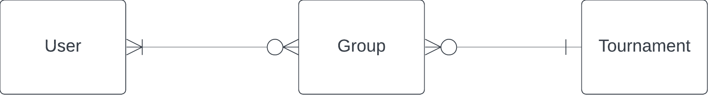
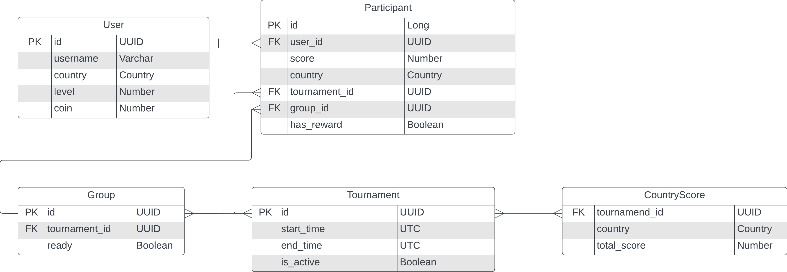

# Backend Engineering Case Study - Dream Games

## Design Choices

### Entities and Relationships

After analyzing the case requirements, I identified the following key entities: **User**, **Tournament**, and **Group**. Their relationships can be described as follows:
- A **User** can participate in multiple **Groups** across different tournaments.
- A **Group** consists of multiple users, with each group competing in a specific tournament.
- There is a **many-to-many** relationship between **Users** and **Groups**.
- A **Tournament** can contain multiple groups, creating a **one-to-many** relationship between **Groups** and **Tournaments**.

The entity-relationship diagram is as follows:

### Relational Diagram

To model the relationships between these entities, I designed the following relational schema. I introduced a **Participant** table to capture the many-to-many relationship between users and groups. Participants store game-related data such as their score and whether they have claimed their rewards. The **CountryScore** table aggregates scores for each country, facilitating the leaderboard logic.

### Key Entities:
- **User**: Stores user information such as level, coins, and assigned country.
- **Group**: Represents the group of users competing in a tournament. It has a `ready` field to indicate whether the group is ready to start.
- **Participant**: Represents users in groups for the current tournament, storing score and reward status.
- **CountryScore**: Stores the total score for each country, updated in real-time as users progress.

## Implementation Details

The backend logic is organized into the following main services:
- **UserService**: Manages user creation, updates user levels, and publishes events when a user progresses. It handles validations related to user participation and tournament eligibility.
- **TournamentService**: A wrapper for all tournament-related logic. It coordinates tournament lifecycle events and delegates tasks to **TournamentGroupService** and **CountryScoreService**.
- **TournamentGroupService**: Assigns users to groups in an ongoing tournament. It finds an available group (one that isn't full and has no users from the same country) using an optimized SQL query. It also manages group leaderboards and reward distribution.
- **CountryScoreService**: Updates and retrieves the country leaderboard, sorting scores in real time.

### Key Decisions:
- **SQL-based Group Assignment**: To minimize input-output communication with the database and ensure performance efficiency, I chose to handle group assignment via a SQL query rather than in application code.
- **Validation Structure**: Basic validations are performed in service classes. While a separate validation layer could improve modularity, the limited number of validations made it reasonable to integrate them directly within private service methods.

## API:
| **Controller**        | **HTTP Method** | **Endpoint**                  | **Request Body**                | **Response**                       | **Description**                          |
|-----------------------|-----------------|-------------------------------|---------------------------------|------------------------------------|------------------------------------------|
| `TournamentController` | POST            | `/tournament/enter`           | `EnterTournamentRequest`        | `EnterTournamentResponse`          | Enter a tournament.                      |
| `TournamentController` | POST            | `/tournament/claim-reward`    | `ClaimRewardRequest`            | `ClaimRewardResponse`              | Claim a reward for a tournament.         |
| `TournamentController` | GET             | `/tournament/group-leaderboard` | `GroupLeaderboardRequest`      | `GroupLeaderboardResponse`         | Get the group leaderboard for a tournament. |
| `TournamentController` | GET             | `/tournament/country-leaderboard`| `CountryLeaderboardRequest`   | `CountryLeaderboardResponse`       | Get the country leaderboard for a tournament. |
| `TournamentController` | POST            | `/tournament/start-tournament`| None                            | None                               | Start a tournament.                      |
| `TournamentController` | POST            | `/tournament/end-tournament`  | None                            | None                               | End a tournament.                        |
| `UserController`       | POST            | `/user`                       | `UserSaveRequest`               | `UserResponse`                     | Create a new user.                       |
| `UserController`       | PUT             | `/user/update-level`          | `UserUpdateLevelRequest`        | `UserUpdateLevelResponse`          | Update the user's level or progress.     |

## Note:
I added start-tournament and end-tournament endpoints to simulate scheduled calls manually for testing purposes. 

## Testing and Validation

Unit tests were written for all public methods in the service classes, ensuring correctness and robustness of the backend logic. 

## Running the Application

1. **Initial Data**: To demonstrate the system, I have defined some initial dump data in `mysql-db-dump.sql`. This includes 10 pre-configured users (`player1`, `player2`, ..., `player10`), who have enough coins and levels to participate in tournaments.
    - Note: At the start, `player1` and `player2` have unclaimed rewards from a previous tournament.

2. **Postman Collection**: A Postman collection is included in the repository to easily test all API endpoints in sequence. Simply follow the requests in the provided collection to interact with the system and observe the various business logic and validations.
